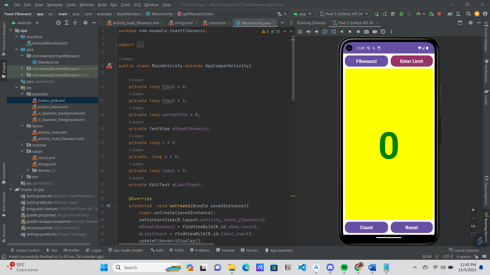
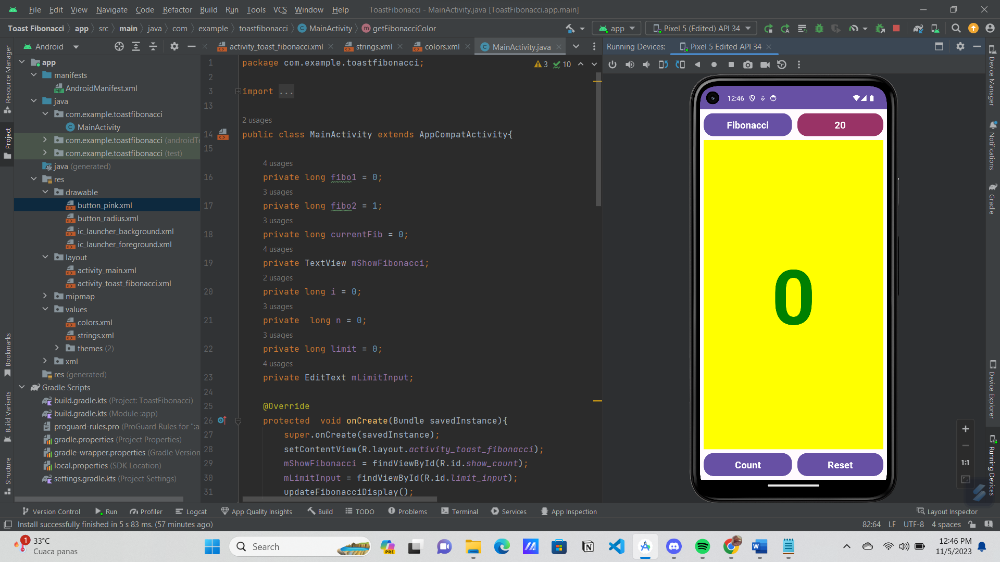
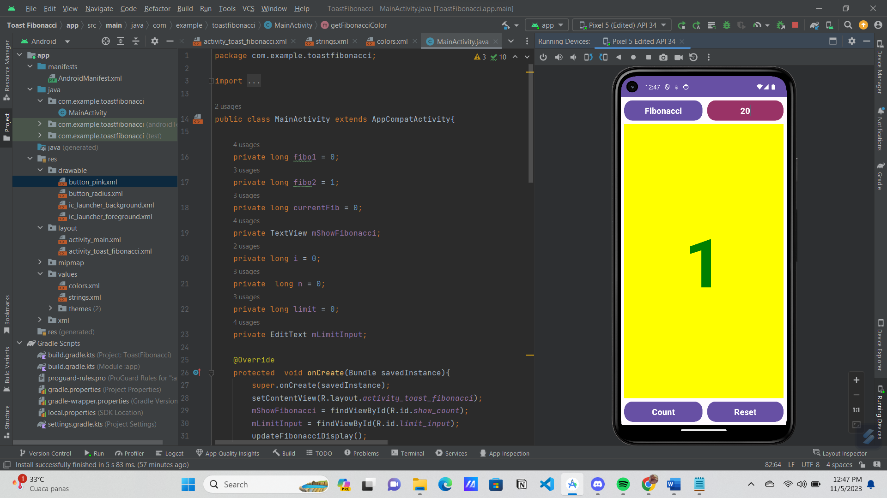
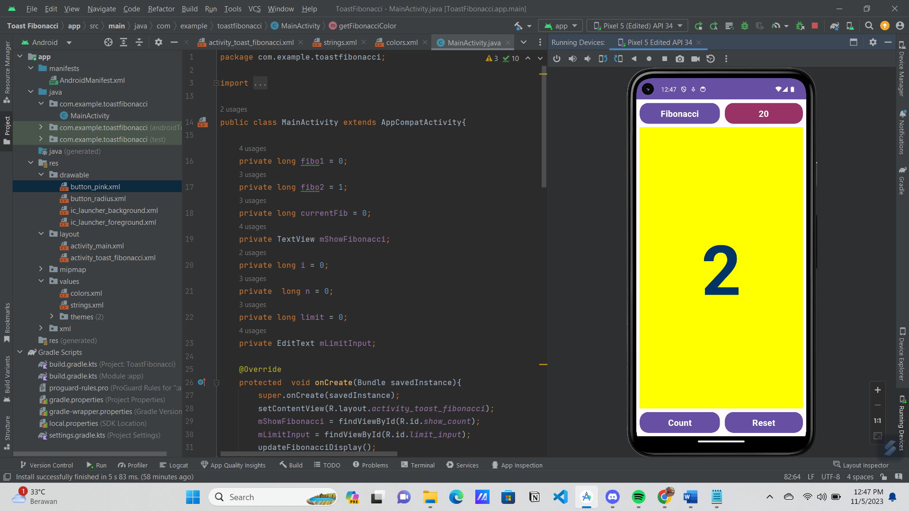
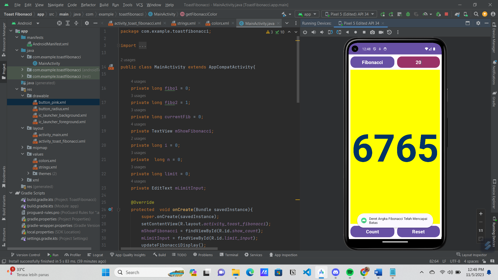
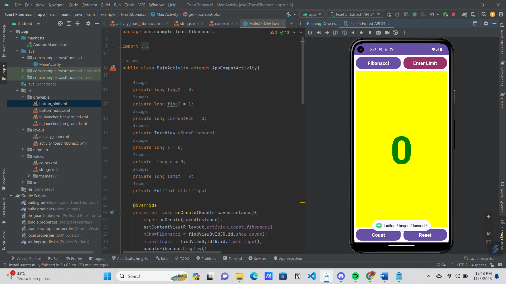

# Project UTS { Semester 3 } 

|**Nama**|**NIM**|**Kelas**|**Matkul**|
|----|---|-----|------|
|Muhammad Ikhsan Fakhrudin|312210019|TI.22.A.2|Pemrograman Mobile 1|

# Deret Fibonacci

## Definisi Deret Fibonacci

>**Deret Fibonacci** adalah urutan angka yang dimulai dengan angka 0 dan 1, kemudian setiap angka berikutnya adalah hasil penjumlahan dari dua angka sebelumnya. Dengan demikian, deret ini memiliki pola pertumbuhan eksponensial. **Deret Fibonacci** biasanya ditulis sebagai berikut :
>
>``0, 1, 1, 2, 3, 5, 8, 13, 21, 34, ...``
>
>Dalam deret ini, angka pertama adalah 0, angka kedua adalah 1, dan setelah itu, setiap angka berikutnya adalah hasil penjumlahan dari dua angka sebelumnya. Misalnya, 2 adalah hasil penjumlahan dari 1 + 1, 3 adalah hasil penjumlahan dari 1 + 2, 5 adalah hasil penjumlahan dari 2 + 3, dan seterusnya.
>
>**Deret Fibonacci** pertama kali diperkenalkan oleh matematikawan Italia bernama ``Leonardo of Pisa``, yang juga dikenal sebagai Fibonacci, dalam bukunya "Liber Abaci" pada tahun 1202. Deret ini muncul dalam berbagai konteks dalam matematika, ilmu komputer, ilmu alam, dan banyak bidang lainnya. Beberapa aplikasi dari deret Fibonacci meliputi permodelan pertumbuhan populasi, analisis pasar keuangan, dan desain algoritma.

## Penjelasan dari MainActivity.java

*Agar File **README.md** Tidak Terlalu Panjang dan Apabila Temen-temen Ingin Membaca Penjelasan nya , Silahkan Klik Link Yang Ada di Bawah Ini Yaa...*

- [Link Penjelasan MainActivity.java](https://bit.ly/3SzIGUi)

## Output

***Keterangan :***

- Berikut adalah tampilan apabila ``telah berhasil di RUN`` di awali dengan angka 0.

## Output

***Keterangan :***

- Selanjutnya, sebelum ``mengklik tombol Count``, sebaiknya isi angka pada Enter Limit terlebih dahulu. Sebagai contoh, saya mengisi limit dengan angka 20.

## Output 

***Keterangan :***

- Selanjutnya, bisa langsung ``klik tombol Count``. Maka, tampilannya akan berubah dari angka 0 menjadi angka 1.

## Output

***Keterangan :***

- **Deret Fibonacci** memiliki pola sebagai berikut: ``0, 1, 1, 2, 3, 5, 8, 13, 21, 34, 55, ...`` Oleh karena itu, setelah angka 1 muncul, angka berikutnya juga akan menjadi angka 1. Perubahan angka ini ditandai dengan perubahan warna pada angka tersebut.

## Output

***Keterangan :***

- Selanjutnya, setelah angka 1 muncul dua kali, angka berikutnya akan menjadi 2. Angka-angka selanjutnya akan mengikuti urutan deret Fibonacci, yaitu ``0, 1, 1, 2, 3, 5, 8, 13, 21, 34, 55, ....``

## Output

***Keterangan :***

- Ketika deret Fibonacci mencapai limit, maka akan tampil teks *"Deret Angka Fibonacci Telah Mencapai Batas"*. Ketika kita ``klik tombol Count``, maka tidak akan dilanjutkan dan hanya berhenti di angka limit tersebut.

## Output

***Keterangan :***

- Selanjutnya, jika kita ``klik tombol Fibonacci,`` maka akan muncul tampilan teks *"Latihan Bilangan Fibonacci !"*.

## Ouput

***Keterangan :***

- Terakhir, ini adalah tampilan apabila ``diklik tombol Reset``, semua akan kembali ke tampilan awal, dimulai dari angka 0, dan harus memasukkan limit lagi.

## SELESAI  

